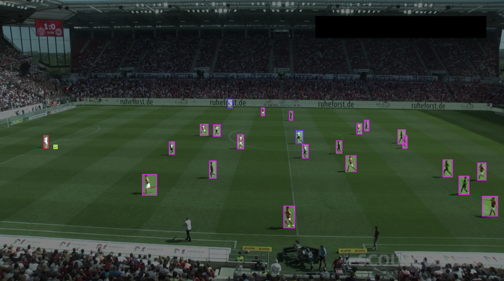

# **Football Insights**

### Computer vision based system to track the flow of football matches and create player-specific summaries. 

## Demo


---

## Computer Vision Tasks Used:

- **Object Detection**: YOLO
- **Object Tracking**: ByteTrack, Deepsort
- **Pose Estimation**: YOLO

## Dataset:

The [Dataset](https://universe.roboflow.com/roboflow-jvuqo/football-players-detection-3zvbc/dataset/4) used is from **Roboflow**. It contains 255 images: 204 train, 38 validation, 13 test. 



### Downloading the Dataset:

```python 
!pip install roboflow

from roboflow import Roboflow
rf = Roboflow(api_key="YOUR_KEY")
project = rf.workspace("roboflow-jvuqo").project("football-players-detection-3zvbc")
dataset = project.version(4).download("DATASET_TYPE")
```

# **Results:**

## 1. Object Detection:

---
### **Custom Training:**

Custom training becomes a viable option when the baseline YOLO models prove ineffective due to various constraints. Limited availability of freely accessible labeled datasets further complicates the situation. Consequently, we embarked on a brief experimental process to identify the most suitable model for our specific data.

#### **YOLOv8:**

| Model      | Epoch | Batch Size | Image Size | Precision | Recall | mAP50 | mAP50-95 | Ball Detection Rate |
| :---:  | :---: | :---: | :---: | :---: | :---: | :---: | :---: | :---: |
| M     | 25 | 16 | 400 |  0.510 |  0.470 |  0.515 |  0.288 | 0.11 |
| M     | 25 | 16 | 600 |  0.898 |  0.578 |  0.679 |  0.442 | 0.13 | 
| M     | 25 | 16 | 800 |  0.763 |  0.720 |  0.740 |  0.518 | 0.16 | 
| M     | 25 | 8 | 900 |  0.804 |  0.732 |  0.771 |  0.559 | 0.18 |
| M     | 25 | 8 | 1000|  0.865 |  0.759 |  0.806 |  0.591 | 0.23 |
| M     | 25 | 4 | 1400|  0.887 |  0.823 |  0.866 |  0.638 | 0.40 |
| M     | 65 | 4 | 1400|  0.944 |  0.828 |  0.872 |  0.665 | 0.42 |
| M     | 25 | 2 | 1920|  0.934 |  0.805 |  0.871 |  0.627 | 0.49 |
| L     | 25 | 2 | 1920|  0.956 |  0.804 |  0.887 |  0.642 | 0.54 |
| L     | 25 | 2 | 1920|  0.940 |  0.850 |  0.880 |  0.670 | 0.54 |
| X     | 25 | 2 | 1920|  0.911 |  0.868 |  0.901 |  0.655 | 0.54 |
| X     | 65 | 2 | 1920|  0.927 |  0.859 |  0.902 |  0.678 | 0.66 |


---


### **Baseline Model:**

I utilized **Ultralytics'** largest pre-trained model, *yolov8x.pt* as the baseline for my experiments. Two different confidence thresholds, **0.1** and **0.3**, were employed to assess the detection capability of YOLO for identifying the "sports ball" object. The original 720p resolution was maintained, and only the "person" and "sports ball" classes were considered for detection purposes.

---

### **Confidence = 0.1:**


---

### **Confidence = 0.3:**


## 2. Human Pose Estimation:

---

### **Baseline Model:**

Pose estimation is a new feature of yolo8 that has just come out recently. It has many pretrained models and their largest one is yolov8x-pose-p6.pt. These models work much better with one-shot detection hence the low performance on multi-object pose estimation.

---

### **Confidence = 0.01:**


### **Baseline Model with Action Prediction:**

TODO

---

## 3. Object Tracking

---
### **ByteTrack:**

ByteTrack incorporates a tracking-by-detection framework, where object detection is performed in each frame, and the detections are linked over time to form object tracks. To improve the tracking performance, ByteTrack employs a motion-guided feature aggregation technique that utilizes motion cues to refine the object features. This approach helps handle challenging scenarios where appearance alone may not be sufficient for accurate tracking. ByteTrack, with its default settings, falls slightly behind the performance of DeepSort, another popular object tracking algorithm.

### **Baseline:**
---


---

### **Trained:**


### **Deepsort:**
