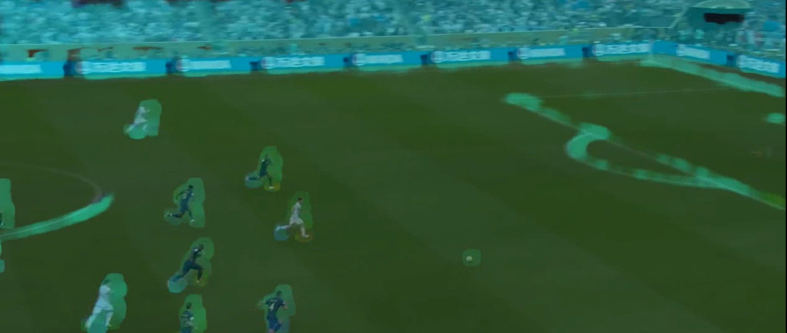

# **Football Insights**

### Computer vision based system to track the ball. 

## Computer Vision Tasks Used:

- **Object Detection**: YOLOv8
- **Object Segmentation**: SAM
- **Object Tracking**: XMem, RAFT, Dense Optical Flow, Stereo Optical Flow, UniMatch

# **Results:**

## 1. Object Tracking

---

### **Dense Optical Flow:**

Dense optical flow is a computer vision technique that computes the motion vectors of every pixel in a pair of consecutive frames of a video sequence. The motion vectors provide information on how objects in the scene are moving between frames, which can be used for tasks such as object tracking, scene analysis, and video stabilization. Dense optical flow is widely used in applications such as autonomous vehicles, surveillance systems, and video editing.

#### **Result:**

The result of the dense optical flow appears to be accurate in tracking the players as the processing was fast and followed their movement. However, one drawback was that the algorithm also tracked the moving grass which resulted in a larger label around the ball. This could affect the overall accuracy of the ball detection and tracking. Another issue was that the algorithm also tracked the spectators which slowed down the video processing. Hence, removing the spectators from the video could potentially improve the speed and accuracy of the algorithm. Hard to segment out the ball from results.

### **XMem:**

The Atkinson-Shiffrin Memory Model is a memory architecture that emulates how humans store and retrieve information over time. In the context of Long-Term Video Object Segmentation, this model is used to store the object mask provided for the first frame of a video and then use it to track the object throughout the rest of the video. This approach allows for more accurate and stable segmentation of objects over a longer period of time, making it useful for applications such as surveillance and autonomous driving.

#### SAM+XMem

#### **Result:**

I used three different approaches for the first mask, and each of them used SAM. The first approach involved segmenting everything and providing this mask to XMem, which then tracked everything. However, my Google Colab couldn't handle this much memory allocation, and it always crashed.

The second approach involved providing the (x,y) position for the ball, and SAM automatically segmented the ball and only followed it.

The third approach involved providing the bounding box coordinates for the ball (x1,y1,x2,y2), and SAM segmented the ball inside it. Out of the three approaches, I used the third approach, where I merged SAM+XMem and had to use YOLO to detect the ball. After the ball was detected, I could use the bounding box coordinates to proceed.

## 2. Object Segmentation
---
### **SAM:**

The Segment Anything Model (SAM) produces high quality object masks from input prompts such as points or boxes, and it can be used to generate masks for all objects in an image. It has been trained on a dataset of 11 million images and 1.1 billion masks, and has strong zero-shot performance on a variety of segmentation tasks.

#### **Result:**

The SAM provided always really accurate segmentation, which was very useful for my task. However, it was quite slow, and I had to use it only for the first frame. Despite its slow speed, the segmentation was accurate, which was very important for me.

Using accurate segmentation was crucial because it allowed me to track the object of interest without any errors. The accuracy ensured that the object was properly recognized and tracked, which is very important in tasks such as object detection and tracking.

### **UniMatch/RAFT:**

RAFT (Real-time All-frame Tracker) is for object tracking that uses an optical flow estimation approach. It is known for its robustness and accuracy in tracking objects in challenging video sequences, such as those with occlusions and fast motion. RAFT is designed to operate in real-time, making it suitable for a wide range of applications, including autonomous driving, surveillance, and robotics. UniMatch is built top of the RAFT its a Transformer-based model.

#### **Result:**

The dense and stereo methods showed better accuracy in object tracking, but the processing speed was slow, which made it impractical for real-time applications. Therefore, we needed to explore alternative solutions that could balance accuracy and speed in object tracking.

## 3. Object Detection:
This section of the code was utilized solely for the purpose of detecting the ball in the first frame, as implemented by Tamas.

